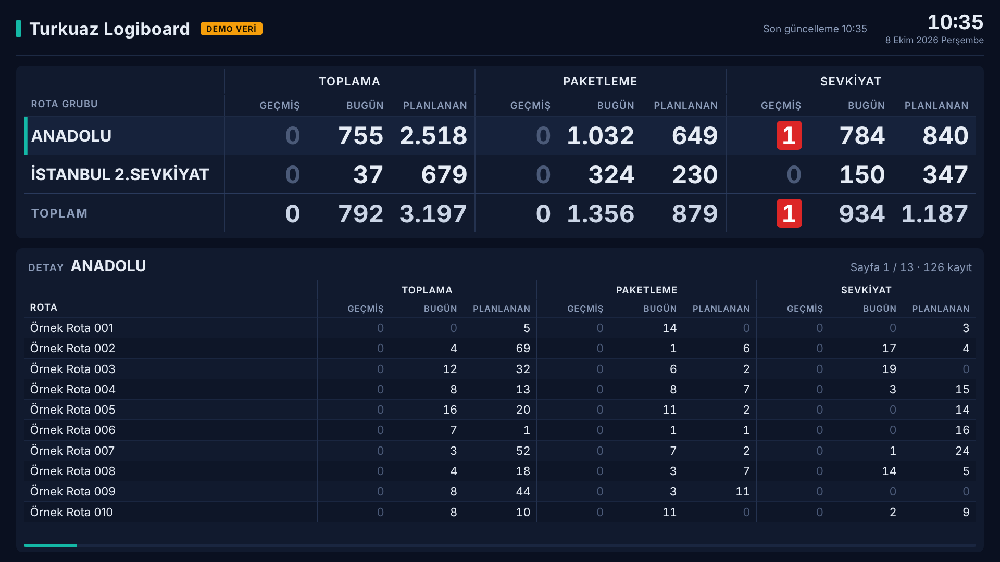

# Turkuaz Logiboard – Depo İçi Ekran

ERP'den gelen `Turkuaz_Logiboard` verisini depo içi ekranlarda (Omma / Signalive) gösteren tek dosyalık HTML içerik: [`index.html`](index.html).



## Ekranda ne var?

- **Özet tablo (üst):** Her rota grubu (`DispatchRouteGroupTitle`) bir satırda; Toplama / Paketleme / Sevkiyat için Geçmiş – Bugün – Planlanan değerleri. Birden fazla grup varsa altta **TOPLAM** satırı.
- **Detay tablo (alt):** Seçili grubun `Details` listesi. Ekrana sığdığı kadar satır gösterilir, sayfalar `pageSeconds` aralıkla döner, bir grubun sayfaları bitince sıradaki gruba geçilir. Özet tabloda o an detayı gösterilen grup vurgulanır.
- **Uyarılar:** `Geçmiş` değeri 0'dan büyükse kırmızı gösterilir; 0 değerler soluk yazılır. Veri `staleMinutes` dakikadan eskiyse üstteki güncelleme bilgisi sarıya döner.
- **Ölçekleme:** 1080p, 4K ve dikey ekranlarda aynı oranlarla ölçeklenir. Sütuna sığmayan büyük sayılar kesilmez, yazı boyutu küçültülür.
- **Eski oynatıcılar:** Kod ES5 ve flexbox ile yazıldı, dışarıdan font veya kütüphane yüklemez (internetsiz çalışır).

## Omma'ya kurulum

1. Omma'da ERP verisinin yazıldığı **veri kaynağının (datasource)** adını kontrol edin. Varsayılan ad `Turkuaz_Logiboard`. Farklıysa `index.html` içindeki `CONFIG.datasourceName` değerini değiştirin. İçerikte tek veri kaynağı varsa ad uyuşmasa da o kullanılır.
2. Yeni içerik oluşturup **Code Editor**'ü açın ve `index.html` dosyasının tamamını yapıştırın. Editör HTML / CSS / JS'i ayrı sekmelerde istiyorsa `<style>` içini CSS'e, `<script>` içini JS'e, `<body>` içini HTML'e koyun.
3. **Test** ile kontrol edip ekranlara yayınlayın.

Sayfa Omma'nın [content helper](https://github.com/signalive/content-api-docs/blob/master/content-helper.md) API'sini kullanır:

```js
omma.setVersion('v1');
omma.ready(function () {
  var ds = omma.datasource.get('Turkuaz_Logiboard');
  // ilk çizim: ds.data
  ds.on('update', function (d) { /* ERP veriyi güncelleyince ekran kendini yeniler */ });
});
```

ERP veri kaynağını güncellediğinde ekran sayfa yenilenmeden güncellenir ve gösterdiği grupta kalır.

## Beklenen veri yapısı

Veri doğrudan dizi olarak ya da `Turkuaz_Logiboard` anahtarı altında gelebilir (JSON metni olarak gelmesi de sorun değil):

```json
{
  "Turkuaz_Logiboard": [
    {
      "DispatchRouteGroupTitle": "ANADOLU",
      "TotalPickingPast": 0,  "TotalPickingToday": 755,  "TotalPickingPlanned": 2518,
      "TotalPackingPast": 0,  "TotalPackingToday": 1032, "TotalPackingPlanned": 649,
      "TotalShippingPast": 1, "TotalShippingToday": 784, "TotalShippingPlanned": 840,
      "Details": [ { "...": "..." } ]
    }
  ]
}
```

### `Details` alanları

Detay tablosunun sütunları **veriden otomatik çıkarılır**, ERP'de alan eklenip çıkarılınca kodu değiştirmek gerekmez:

- Metin alanları (müşteri, rota, sipariş no vb.) solda gösterilir.
- `PickingPast`, `PackingToday`, `ShippingPlanned` gibi adlandırılmış alanlar (başında `Total` olsun ya da olmasın) özet tablodaki gibi **Toplama / Paketleme / Sevkiyat** başlıkları altında gruplanır.
- Diğer sayısal alanlar en sağda gösterilir.
- Sütun başlıklarını Türkçeleştirmek için `index.html` içindeki `LABELS` nesnesine alan adı ekleyin, ör. `CustomerName: 'Müşteri'`. Listede olmayan alan adları okunur hale getirilerek gösterilir (`CustomerName` → `Customer Name`).
- Gösterilmesini istemediğiniz alanları `CONFIG.hiddenDetailColumns` içine yazın, ör. `['Id']`.

## Ayarlar (`index.html` → `CONFIG`)

| Ayar | Varsayılan | Açıklama |
|---|---|---|
| `title` | `Turkuaz Logiboard` | Üst başlık |
| `datasourceName` | `Turkuaz_Logiboard` | Omma veri kaynağı adı |
| `rootKey` | `Turkuaz_Logiboard` | Veri nesne içinde geliyorsa listenin anahtarı |
| `groupTitleKey` | `DispatchRouteGroupTitle` | Grup başlığı alanı |
| `detailsKey` | `Details` | Alt detay listesi alanı |
| `pageSeconds` | `10` | Detay tablosunda her sayfanın ekranda kalma süresi (sn) |
| `staleMinutes` | `30` | Veri bu süreden eskiyse uyarı (0 = kapalı) |
| `hiddenDetailColumns` | `[]` | Detayda gizlenecek alanlar |
| `dataUrl` | `''` | Omma veri kaynağı yerine ERP'nin JSON adresinden doğrudan çekmek için (opsiyonel) |
| `refreshSeconds` | `60` | `dataUrl` kullanılırsa yenileme aralığı (sn) |

`dataUrl` kullanılacaksa ERP servisinin ekranın açıldığı adrese CORS izni vermesi gerekir.

## Tarayıcıda önizleme

`index.html` dosyasını normal bir tarayıcıda açın. Omma dışında ve `dataUrl` boşken sayfa **DEMO VERİ** etiketiyle örnek veri gösterir. Toplamlar gerçek ekran görüntüsündeki değerlerdir, detay satırları ("Örnek Rota 001" …) uydurmadır.
